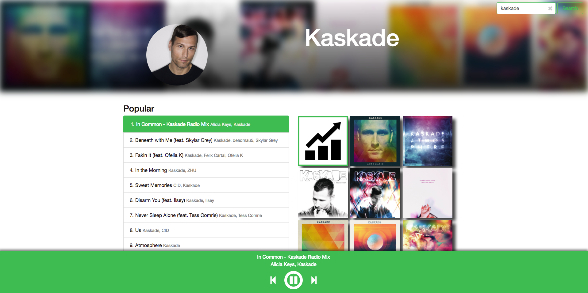

# Artist Profile Page

## Installation
- Clone down the repo
- Install NPM dependencies in terminal: `npm install`
- Run: `npm start`
- navigate to localhost:8000

## Usage

- Enter an artist name in the search bar and press enter or click search
- Click on the song you wish to preview
- Browse through albums by scrolling vertically if on desktop, scroll horizontally on mobile
- Browse through related artists by scrolling horizontally
- Control audio with the audio bar that is fixed to the bottom of window
